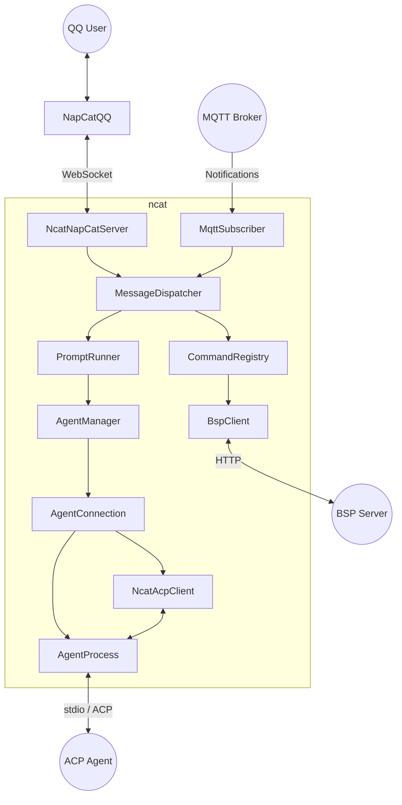

# ncat (NapCat ACP Client)

一个 Python 桥接器，将 [NapCatQQ](https://github.com/NapNeko/NapCatQQ) 连接到任何支持 [ACP](https://agentclientprotocol.com/) (Agent Client Protocol) 的 AI 智能体 —— 让你通过 QQ 与 AI 编程助手聊天。

## 工作原理

ncat 作为一个 **ACP 客户端**：收到某个 QQ chat 的第一条普通消息后，才会按需拉起该 chat 对应的 Agent 子进程，并通过标准输入输出（stdin/stdout）与之建立 ACP 连接；来自 QQ（通过 NapCatQQ）的消息经 ncat 桥接到智能体。

```text
QQ 用户 → NapCat (WebSocket 客户端) → ncat →（子进程 stdin/stdout）→ ACP 智能体
QQ 用户 ← NapCat (WebSocket 客户端) ← ncat ←（子进程 stdin/stdout）← ACP 智能体
```

## 快速启动

### 安装与运行

```bash
# 安装依赖
uv sync

# 从模板创建配置
cp config.example.toml config.toml

# 编辑 config.toml 后启动
uv run python main.py
# 或指定配置文件路径（用于指定另一套配置及持久化数据位置）
uv run python main.py /path/to/your.toml
```

**核心配置说明**：

为了让程序正常跑起来，你必须在 `config.toml` 中配置你要启动的 Agent。
打开 `config.toml`，找到 `[agent]` 块：
- `command`: ACP Agent 的可执行文件路径或命令名（例如 `"claude"`）。
- `args`: 传递给 Agent 的启动参数（例如 `["--experimental-acp"]`）。
- `workspace_root`: 工作区根目录（默认 `"/workspace"`）。
- `default_workspace`: 默认工作区名；当用户发送 `/new` 而不带参数时，会使用 `workspace_root/default_workspace`。

其他诸如日志目录、UX 体验优化、网络端口等丰富配置，请直接阅读 `config.example.toml` 中的注释，默认配置即可运行。

**持久化数据**：ncat 运行过程中产生的持久化数据主要有日志文件和工作区目录。它们均可在 `config.toml` 中指定（`[logging] dir` 和 `[agent] workspace_root`）。单独运行时，日志默认落在 `data/logs/`；被 `stack` 托管时，推荐改为工作区集中日志目录。当前 `ncat.log` 已采用一行一个 JSON 对象的结构化日志格式，适合后续按字段查询。

## 指令系统

ncat 提供了一套完善的指令系统，你可以直接在 QQ 中向机器人发送以下指令。

### 基础指令

- `/new [workspace]` - 结束当前会话并清空 AI 上下文，同时停止当前 chat 对应的 Agent 子进程。下次发普通消息时，ncat 会在新的工作区懒启动一个新的 Agent，并创建一个新的 ACP 会话。可选参数用于指定 `workspace_root` 下的工作区；若目录不存在会自动创建。ncat 会把该工作区的绝对路径传给 ACP `session/new.cwd`，并在同一路径启动新的 Agent 子进程。
- `/stop` - 只中断当前这一次 AI 思考（当前 prompt turn），不会清空当前会话上下文。
- `/send <text>` - 将文本原样转发给 agent（避免以 `/` 开头的文本误触发 ncat 指令）。
- `/help` - 显示指令列表与帮助信息。

### 后台会话指令 (Background Session)

ncat 支持将耗时较长或需要后台独立运行的 Agent 任务放入后台会话。

> **注意**：要使用后台会话功能，你必须在 `config.toml` 中开启并配置 `[bsp_server]` (Background Session Protocol Server) 和 `[mqtt]` (用于接收后台运行状态的异步推送通知)。

- `/bg new <prompt>` - 创建一个后台会话并发送 prompt。
- `/bg newn <name> <prompt>` - 创建一个指定名称的后台会话。
- `/bg ls` - 列出所有后台会话及其运行状态。
- `/bg to i <index> <prompt>` - 向指定编号的后台会话追加发送 prompt。
- `/bg to n <name> <prompt>` - 向指定名称的后台会话追加发送 prompt。
- `/bg stop i <index>` - 停止指定编号的后台会话。
- `/bg stop n <name>` - 停止指定名称的后台会话。
- `/bg stop wait` - 停止所有等待输入中的后台会话。
- `/bg stop all` - 停止所有后台会话。
- `/bg history i <index>` / `/bg history n <name>` - 查看指定会话的完整对话历史。
- `/bg last i <index>` / `/bg last n <name>` - 查看指定会话的最后一条 AI 输出。

## 部署为系统服务 (Systemd)

在 Linux 上，你可以将 ncat 部署为自动随系统启动的服务：

```bash
sudo bash scripts/install-service.sh
```

安装后：
- 启动服务: `sudo systemctl start ncat`
- 查看状态: `sudo systemctl status ncat`
- 实时日志: `journalctl -u ncat -f`

## 架构与模块

ncat 具备两个主要通信面：**NapCat 侧** 接收 NapCatQQ 的 WebSocket 事件，**ACP 侧** 以子进程方式启动 AI Agent，通过 stdin/stdout 进行 ACP (JSON-RPC 2.0) 通信。同时引入了对 BSP 后台任务和 MQTT 异步通知的支持。



**核心模块一览**：
- `main.py`：程序入口。
- `napcat_server.py`：面向 NapCat 的 WebSocket 传输层。
- `dispatcher.py`：消息分发、解析与过滤。
- `command_system.py` / `command.py` / `bg_command.py`：统一的指令注册与路由系统，支持正则匹配与帮助文档生成。
- `prompt_runner.py`：单次 prompt 生命周期管理（超时、发送、取消）。
- `agent_manager.py`：会话编排与连接生命周期管理。
- `agent_process.py` / `agent_connection.py`：Agent 子进程管理与底层 stdio 管道封装。
- `acp_client.py`：ACP 协议的回调处理。
- `bsp_client.py` / `mqtt_subscriber.py`：后台任务 HTTP 客户端与 MQTT 异步状态订阅。

## 前台会话生命周期

前台对话目前采用“每个 chat 一个 Agent 进程 + 一个 ACP 连接 + 一个持续复用的 ACP session”的模型：

- ncat 启动时不会预先启动 Agent。
- 某个 chat 的第一条普通消息到来时，才会懒启动该 chat 的 Agent 子进程，建立 ACP 连接并完成 `initialize`。
- 连接建立后，ncat 为该 chat 创建一个 ACP session；只要用户没有发送 `/new`，后续普通消息都会持续复用这个 session。
- 某些 Agent 会在 `session/prompt` 返回后继续送达少量尾部 `session/update` 分片；ncat 会在转发到 QQ 前短暂等待这些尾部流式分片，避免长回复被截断。
- `/stop` 只会对当前 prompt turn 发送 `session/cancel`，不会结束会话，也不会重启 Agent 进程。
- `/new` 会丢弃当前 session、本地清空上下文，并停止该 chat 对应的 Agent 子进程；下一条普通消息才会重新启动新的 Agent 并创建新的 session。
- 如果 Agent 在一次对话中发生异常，ncat 会关闭当前 session；下一次普通消息会自动创建一个新的 session。
