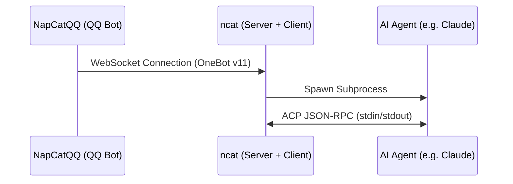

# ncat Architecture

**ncat** (NapCat ACP Client) bridges NapCatQQ and ACP-compatible AI agents.
It acts as a **WebSocket server** for NapCatQQ (OneBot v11) and an
**ACP client** for the AI agent subprocess.

## High-Level Overview



ncat has two communication interfaces:

- **NapCat side (server)**: Listens for WebSocket connections from NapCatQQ,
  receives OneBot v11 events, sends API calls back.
- **ACP side (client)**: Spawns an AI agent as a subprocess, communicates via
  the Agent Client Protocol (JSON-RPC 2.0 over stdin/stdout).

## Module Map

```
main.py                      Entry point: loads config, starts agent, runs server
ncat/
├── config.py                Configuration loading (config.toml → dataclasses)
├── log.py                   Logging setup (console + rotating file handler)
├── napcat_server.py         NapCat-facing WebSocket server (transport layer)
├── dispatcher.py            Message dispatcher (parse → filter → route)
├── prompt_runner.py         Prompt lifecycle manager (timeout, send, cancel)
├── permission.py            Permission broker (forward ACP requests to QQ users)
├── command.py               Command executor (/new, /stop, /help)
├── converter.py             Message format conversion (OneBot ↔ internal)
├── image_utils.py           Image download + base64 helpers (httpx)
├── acp_client.py            ACP protocol callbacks (NcatAcpClient)
├── agent_manager.py         ACP agent subprocess manager (AgentManager)
└── __init__.py
```

## Data Flow

A typical message goes through the following path:

```
NapCatQQ
  │ WebSocket event (OneBot v11 JSON)
  ▼
NcatNapCatServer._dispatch_event()
  │ Filters meta/notice/request events; dispatches message events
  ▼
MessageDispatcher.handle_message()
  │ Parses OneBot event → ParsedMessage
  │ Filters group messages without @bot
  │ Tries CommandExecutor first (for /commands)
  │ Checks PermissionBroker for pending permission → intercepts reply
  │ Checks busy state (rejects if AI already processing)
  ▼
PromptRunner.process()
  │ Builds ACP prompt blocks (text + optional images)
  │ Downloads NapCat image URLs when agent supports images
  │ Starts timeout notification timers
  ▼
AgentManager.send_prompt()
  │ Maps chat_id → ACP session_id (creates session if needed)
  │ Sends prompt via ACP connection
  │ Waits for agent to complete the turn
  │                                          ┌──────────────────────────┐
  │   (during await, agent streams chunks)   │ NcatAcpClient            │
  │ ◄─────────────────────────────────────── │   .session_update()      │
  │                                          │   accumulates ContentPart│
  │                                          └──────────────────────────┘
  │                                          ┌──────────────────────────┐
  │   (agent requests tool permission)       │ NcatAcpClient            │
  │ ◄─────────────────────────────────────── │   .request_permission()  │
  │                                          │   → PermissionBroker     │
  │                                          │     → sends QQ message   │
  │                                          │     → awaits user reply  │
  │                                          └──────────────────────────┘
  │ Returns accumulated response parts (list[ContentPart])
  ▼
PromptRunner.process()
  │ Cancels timeout timers
  │ Calls reply_content_fn(event, response_parts)
  ▼
NcatNapCatServer._reply_content()
  │ Converts ContentParts → OneBot segments (text + images)
  │ Sends via WebSocket API call
  ▼
NapCatQQ → QQ User
```

## Module Responsibilities

### `napcat_server.py` — NcatNapCatServer

The transport layer facing NapCatQQ. Responsibilities:

- WebSocket server lifecycle (bind, accept connection)
- Raw JSON parsing and event dispatching by `post_type`
- Bot QQ ID extraction from first received event
- Outbound OneBot API call/response matching (echo-based)
- Reply sending (`send_private_msg` / `send_group_msg`)
- Closing all ACP sessions on NapCat disconnect

Does **not** contain any business logic — delegates to `MessageDispatcher`.

### `dispatcher.py` — MessageDispatcher

Thin message dispatcher. Pipeline:

1. Parse raw event → `ParsedMessage` (via `converter.onebot_to_internal`)
2. Filter: ignore group messages without @bot
3. Route to `CommandExecutor.try_handle()` (lightweight, non-blocking)
4. Check `PermissionBroker.has_pending()` → intercept reply or show hint
5. Check `PromptRunner.is_busy()` → reject if already processing
6. Dispatch to `PromptRunner.process()`

### `prompt_runner.py` — PromptRunner

Manages the full lifecycle of a single AI prompt request:

- Prompt block construction (`converter.build_prompt_blocks`)
- Image download from NapCat-provided URLs (when agent supports images)
- Active task tracking per chat_id
- Timeout notifications ("AI is thinking...", "/stop hint")
- Delegating to `AgentManager.send_prompt()`
- Error handling (agent crash → notify user, close session)
- Cancellation support (via `asyncio.Task.cancel` + ACP `session/cancel`)

### `command.py` — CommandExecutor

Parses and executes user commands:

| Command | Action |
|---------|--------|
| `/new`  | Close current ACP session (next message creates a new one) |
| `/stop` | Cancel the active AI task via callback to `PromptRunner.cancel` |
| `/help` | Show available commands |

Uses callback injection (`cancel_fn`) to avoid direct dependency on `PromptRunner`.

### `permission.py` — PermissionBroker

Bridges ACP permission requests with QQ user interaction:

- **"Always" cache**: Remembers `allow_always` / `reject_always` decisions
  per session, keyed by `ToolCallUpdate.kind` (including `None` as a key).
- **Pending request**: At most one per chat. Creates an `asyncio.Future`,
  sends a formatted message to the QQ user, and awaits the reply.
- **Timeout**: Configurable via `permission_timeout` (0 = wait forever).
- **Cancellation**: `/stop` cancels the pending permission future.
- **Session cleanup**: `clear_session()` removes cached decisions when a
  session is closed.

### `acp_client.py` — NcatAcpClient

**NcatAcpClient** (ACP protocol callbacks):
- `session_update`: Accumulates `AgentMessageChunk` content into `AgentManager` as ordered `ContentPart` items (text + images)
- `request_permission`: Delegates to `PermissionBroker` for interactive
  user approval (reverse-looks up `chat_id` from `session_id`)
- File system / terminal methods: All rejected (`method_not_found`)

### `agent_manager.py` — AgentManager

**AgentManager** (agent subprocess + session lifecycle):
- Spawns agent subprocess, establishes ACP connection over stdio
- Initializes ACP protocol handshake
- Tracks agent prompt capabilities (e.g. whether images are supported in prompts)
- Maps `chat_id` (QQ chat identifier) → ACP `session_id` (bidirectional)
- Stores last event per chat for permission reply routing
- Sends prompt content blocks and collects accumulated responses as `list[ContentPart]`
- Handles cancellation via ACP `session/cancel`
- Manages agent process start/stop

### `converter.py`

Conversion and prompt-building helpers (stateless):

- `onebot_to_internal()`: OneBot v11 event dict → `ParsedMessage` dataclass
- `build_context_header()`: `ParsedMessage` → context-enriched prompt string
- `build_prompt_blocks()`: `ParsedMessage` (+ downloads) → ACP prompt blocks (text + optional images)
- `content_to_onebot()`: `list[ContentPart]` → OneBot message segment array
- `ai_to_onebot()`: AI response text → OneBot message segment array (text-only convenience wrapper)

### `config.py`

Configuration hierarchy loaded from `config.toml`:

```
NcatConfig
├── ServerConfig      (host, port)
├── AgentConfig       (command, args, cwd)
├── UxConfig          (thinking_notify_seconds, thinking_long_notify_seconds,
│                      permission_timeout, permission_raw_input_max_len,
│                      image_download_timeout)
└── LoggingConfig     (level, dir, keep_days, max_total_mb)
```

## Session Model

Sessions are **in-memory only** — no persistence. The mapping is:

```
chat_id (e.g. "private:12345")  →  ACP session_id (UUID)
```

- A new ACP session is created on the first message from a chat.
- `/new` command removes the mapping; next message creates a fresh session.
- NapCat disconnect closes all sessions immediately.
- Agent crash closes the affected session.

## Dependency Graph

```
main.py
  ├── config.py
  ├── log.py
  ├── agent_manager.py       (AgentManager)
  └── napcat_server.py       (NcatNapCatServer)
        ├── permission.py    (PermissionBroker)
        └── dispatcher.py    (MessageDispatcher)
              ├── permission.py      (PermissionBroker)
              ├── prompt_runner.py   (PromptRunner)
              │     ├── permission.py    (PermissionBroker)
              │     ├── agent_manager.py (AgentManager)
              │     └── converter.py
              ├── command.py         (CommandExecutor)
              │     └── agent_manager.py (AgentManager)
              └── converter.py
```

`NcatAcpClient` (inside `acp_client.py`) triggers permission requests that are
forwarded via `AgentManager.permission_broker`. `AgentManager` references
`PermissionBroker` via a TYPE_CHECKING import to avoid circular dependency.

Key design principle: dependencies flow **inward** — transport modules
(`napcat_server`) know about business logic (`dispatcher`, `prompt_runner`),
but business logic does not import transport. Reply delivery uses an
injected callback (`reply_fn`).
